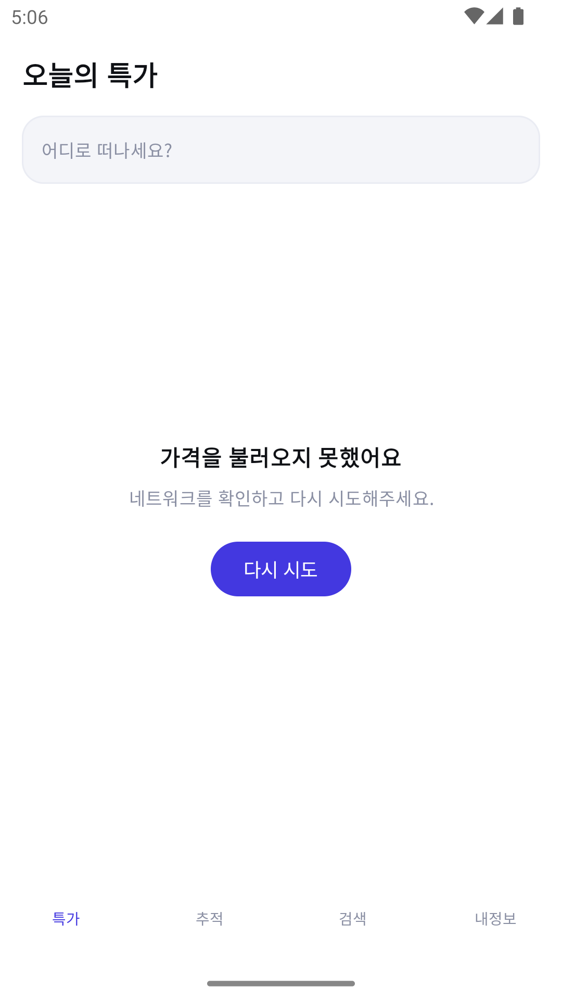

# flightdeal

인천 출발 항공권의 특가를 모아 보여주고, 지정한 노선의 가격 변동을 감지해 알림을 주는 안드로이드 앱.

<p align="left">
  
  
  
</p>

## "실시간 요금 변동"에 대해

이 앱의 출발점은 "항공권 가격이 바뀌는 걸 실시간으로 알 수 있나"라는 질문이었다.
조사한 결론은 **불가능하다**는 것이다. 항공사나 GDS가 가격 변동을 푸시로 전달하는 공개 API는
존재하지 않는다. 국내 여행 앱들이 "평균가 대비 N% 저렴"을 말할 수 있는 이유는
서버가 가격을 계속 조회해 이력 DB를 쌓고 있기 때문이다.

그래서 이 앱도 **폴링 + 가격 이력 + 임계치 판정** 구조를 쓴다. 1단계에서는 그 이력이
서버가 아니라 단말의 Room에 쌓이고, WorkManager가 6시간마다 깨어나 비교한다.
"실시간"이라고 말하지 않고, 화면에도 표시 가격이 참고가임을 명시한다.

## 아키텍처

```
:presentation   → :domain, :data     Composable / ViewModel / Navigation Compose
:data           → :domain            Repository 구현체, Room, DataStore
:domain         (의존성 없음)          모델, Repository 인터페이스, UseCase
```

`:domain`은 순수 Kotlin JVM 모듈이다. 안드로이드 타입을 쓸 수 없고, 데이터 소스의 이름도
등장하지 않는다. 덕분에 핵심 로직 — 할인율 계산과 가격 변동 감지 — 이 에뮬레이터 없이
JVM 단위 테스트만으로 검증된다.

이 경계는 이미 한 번 값을 했다. UI를 XML DataBinding에서 Compose로 통째로 갈아엎었는데
`:domain`과 `:data`는 한 줄도 바뀌지 않았고, ViewModel과 그 테스트도 그대로 살아남았다.

## 기술 스택

Kotlin 2.1 · Jetpack Compose · Material 3 · Hilt · Coroutines/Flow · Navigation Compose ·
Room · DataStore · WorkManager · Retrofit · KSP · Gradle Version Catalog

Java 소스는 한 줄도 없다. compileSdk/targetSdk 36, minSdk 26.

## 현재 상태

기반 구축 완료. 테스트 61건 통과 (`:domain` 31 · `:data` 20 · `:presentation` 10).

특가 피드 화면이 로딩·성공·빈 데이터·오류 네 상태를 모두 처리한다. 지금은 인메모리 Fake
구현체가 데이터를 공급하며, 실제 API 연동은 `:data`의 `FlightPriceRepository` 구현체를
하나 추가하는 것으로 끝난다 — 화면과 도메인은 손대지 않는다.

**빈 데이터는 오류가 아니다.** 데이터 소스가 캐시 기반이라 한산한 노선은 정상적으로 빈 응답을
준다. 그래서 빈 상태에는 재시도 버튼을 숨기는 게 아니라 아예 만들지 않는다. 눌러도 결과가
같기 때문이다.

### 다음

- Travelpayouts 실연동 (한국 노선 데이터 밀도 검증부터)
- Room 가격 이력 + 추적 화면 + 추이 그래프
- `PriceCheckWorker` + 알림
- 날짜별 최저가 캘린더, 목적지 탐색, 예약처 딥링크

## 설계 문서

- [설계](docs/superpowers/specs/2026-08-28-flightdeal-design.md) — 데이터 소스 선정 근거, 도메인 모델, 추적 엔진, 에러 처리
- [구현 계획](docs/superpowers/plans/2026-08-28-flightdeal-foundation.md) — 단계별 작업

## 빌드

JDK 17이 필요하다.

```bash
export JAVA_HOME="$(/usr/libexec/java_home -v 17)"
./gradlew :presentation:assembleDebug
```

API 키는 `local.properties`에 둔다 (커밋되지 않는다).

```properties
TRAVELPAYOUTS_TOKEN=...
TRAVELPAYOUTS_MARKER=...
```
