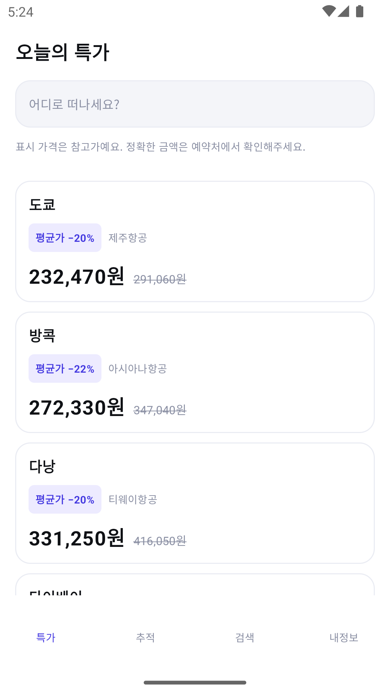
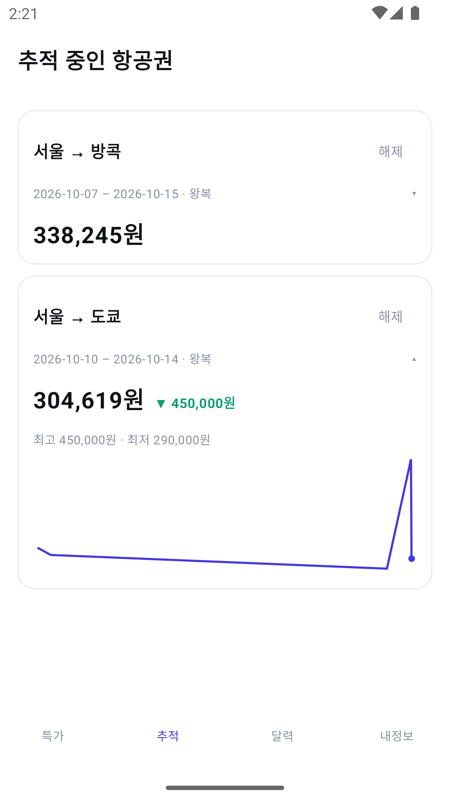
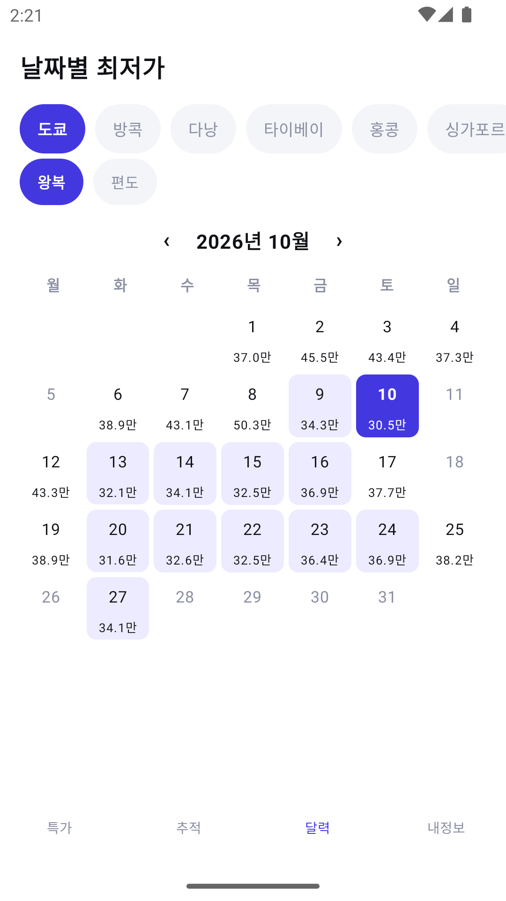
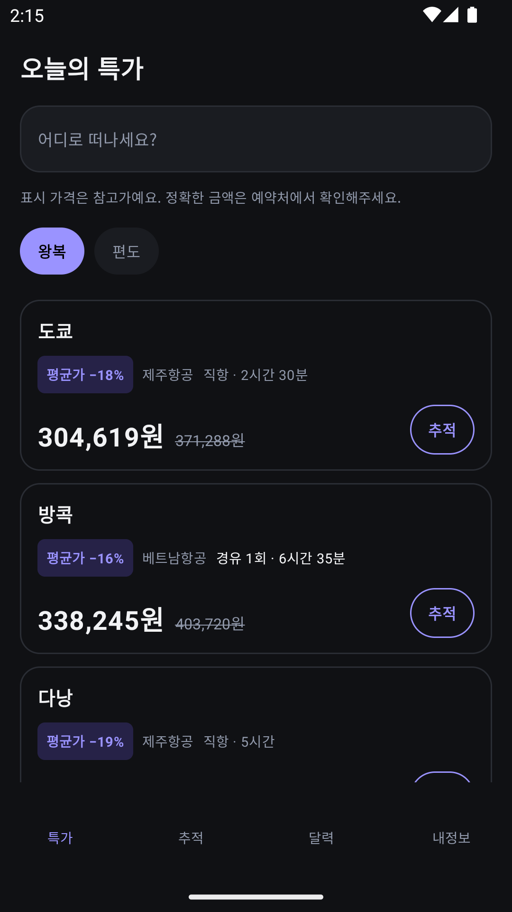

# flightdeal

인천 출발 항공권의 특가를 모아 보여주고, 지정한 노선의 가격 변동을 감지해 알림을 주는 안드로이드 앱.

<p align="left">
  
  
  
  
</p>

전부 실제 Travelpayouts 데이터다.

## "실시간 요금 변동"에 대해

이 앱의 출발점은 "항공권 가격이 바뀌는 걸 실시간으로 알 수 있나"라는 질문이었다.
조사한 결론은 **불가능하다**는 것이다. 항공사나 GDS가 가격 변동을 푸시로 전달하는 공개 API는
존재하지 않는다. 국내 여행 앱들이 "평균가 대비 N% 저렴"을 말할 수 있는 이유는
서버가 가격을 계속 조회해 이력 DB를 쌓고 있기 때문이다.

그래서 이 앱도 **폴링 + 가격 이력 + 임계치 판정** 구조를 쓴다. 그 이력이 서버가 아니라
단말의 Room에 쌓이고, WorkManager가 6시간마다 깨어나 비교한다. "실시간"이라고 말하지 않고,
화면에도 표시 가격이 참고가임을 명시한다.

## 무엇을 하는가

- **특가 피드** — 인천 출발 6개 노선의 실제 최저가. 왕복/편도 전환, 평균가 대비 할인율,
  직항 여부와 비행 시간
- **가격 추적** — 딜을 추적하면 Room에 이력이 쌓이고, 6시간마다 다시 조회해 변동을 알린다.
  카드를 누르면 그동안의 추이가 그래프로 펼쳐진다
- **날짜별 최저가 캘린더** — 목적지와 달을 고르면 날짜별 최저가가 격자로. 가장 싼 날을 강조
- **예약** — 어느 화면에서든 누르면 Custom Tabs로 실제 예약 페이지가 앱 안에서 열린다

## 아키텍처

```
:presentation   → :domain, :data     Composable / ViewModel / Navigation Compose
:data           → :domain            Repository 구현체, Room, Retrofit
:domain         (의존성 없음)          모델, Repository 인터페이스, UseCase
```

`:domain`은 순수 Kotlin JVM 모듈이다. 안드로이드 타입을 쓸 수 없고, 데이터 소스의 이름도
등장하지 않는다. 덕분에 핵심 로직 — 할인율 계산, 가격 변동 감지, 달력 조립 — 이
에뮬레이터 없이 JVM 단위 테스트만으로 검증된다.

이 경계는 세 번 값을 했다. UI를 XML DataBinding에서 Compose로 통째로 갈아엎었을 때,
Fake를 실 API로 바꿨을 때, 그리고 라이트 전용이던 테마를 다크까지 확장했을 때 —
`:domain`은 한 줄도 바뀌지 않았다.

## 기술 스택

Kotlin 2.1 · Jetpack Compose · Material 3 · Hilt · Coroutines/Flow · Navigation Compose ·
Room · WorkManager · Retrofit · Custom Tabs · KSP · Gradle Version Catalog

Java 소스는 한 줄도 없다. compileSdk/targetSdk 36, minSdk 26.
테스트 237건 (`:domain` 70 · `:data` 100 · `:presentation` 67).

`:domain`이 순수 JVM 모듈인 것은 대체로 이득이지만 대가가 하나 있다 —
안드로이드 API 레벨을 아무도 검사하지 않는다. `LocalDate.ofInstant`(API 34)를 써서
minSdk 26인 앱의 워커가 안드로이드 13 이하에서 전부 죽은 적이 있는데,
테스트는 JDK에서 돌아 통과했고 린트는 JVM 모듈을 보지 않았다. 기기에서만 드러났다.

## 만들면서 배운 것

### 반복해서 틀린 건 언제나 같은 모양이었다

> **비교하는 두 값을 서로 다른 규칙으로 고른다.**

네 번 겪었다. 왕복 가격을 편도 분포와 견줘 **할인 배지가 영영 안 떴고**, 등록 기준가는
한국에서 결제 가능한 예약처 중 최저가인데 폴링은 러시아 마켓플레이스를 포함한 전체
최저가를 골라 **첫 실행마다 있지도 않은 하락을 알렸고**, 폴링이 귀국일을 안 맞춰
10/16 왕복이 10/20 견적과 매칭됐고, 조회 실패 시 토글만 바뀌어 화면이 "편도"라고
말하면서 왕복 가격을 보여줬다.

지금은 "이 항공권 얼마인가"에 답하는 규칙이 `trackedPrice()` 한 곳에 있고 모든 화면이
그것을 부른다. 캘린더를 붙일 때도 같은 문제가 생길 뻔했는데 — 통계용 조회는 일부러
예약처를 거르지 않아서 그대로 쓰면 결제 못 하는 가격이 달력에 뜬다 — 통계용과 화면용을
분리하고 KDoc에 용도를 못 박았다.

### "관측했다"와 "알렸다"는 다른 사건이다

둘을 같이 취급하면 변동이 조용히 사라진다. `Result.retry()`가 워커를 다시 돌릴 때
1차 시도의 스냅샷이 비교 대상이 되어 **전달하려던 변동을 스스로 지웠다.** 채널만
음소거해도 `notify()`가 성공을 보고해 기준선이 앞으로 갔다.

그래서 관측 이력(`price_snapshot`)과 통보 기준선(`tracked_route.notifiedPrice`)을
분리했다. 알림이 실제로 뜬 뒤에만 기준선이 움직인다. 실패하면 그대로 남아 다음 실행에
다시 잡힌다 — **놓치는 것보다 중복이 낫다.**

### API 33 미만에서 알림이 전부 죽어 있었다

`minSdk`가 26인데 `POST_NOTIFICATIONS`는 API 33부터다. 그 아래에서 `checkSelfPermission`을
부르면 시스템이 정의조차 모르는 권한이라 항상 거부로 나온다. **지원하는 API 11개 중
7개에서 알림이 통째로 버려지고 있었고, 에러는 어디에도 안 남았다.**

API 30 에뮬레이터에서 확인했다 — `dumpsys package`를 보면 그 권한이 *요청 목록*에는
있고 *부여 목록*에는 없다. `NotificationManagerCompat.areNotificationsEnabled()`로
바꾼 뒤 실제로 알림이 뜨는 것까지 관측했다.

### 알아둘 것

Aviasales는 러시아에서 출발한 서비스라 예약처의 절반가량이 한국에서 결제할 수 없는
CIS 마켓플레이스다. 그래서 **한국에서 예약 가능한 예약처를 우선**해 고르고, 그런 곳이
없으면 그 노선의 최저가라도 보여준다. 완전히 걸러내면 한산한 노선의 화면이 빈다.

**빈 데이터는 오류가 아니다.** 소스가 캐시 기반이라 한산한 노선은 정상적으로 빈 응답을
준다. 그래서 빈 상태에는 재시도 버튼을 두지 않는다 — 눌러도 결과가 같다.
반대로 레이트 리밋과 서버 오류에는 재시도 버튼을 준다.

표시 가격은 참고가다. 소스가 실사용자 검색 기록 기반 7일 캐시라 그 순간 실제 예약
가능한 운임과 다를 수 있고, 화면에도 그렇게 적어두었다.

## 남은 것

- 출발지가 인천 고정 (설계상 의도)
- 내정보 탭 비어 있음
- 커미션 마커 미발급 — 딥링크는 열리되 제휴 수익이 붙지 않는다

## 설계 문서

- [설계](docs/superpowers/specs/2026-08-28-flightdeal-design.md) — 데이터 소스 선정 근거, 도메인 모델, 추적 엔진, 에러 처리
- [구현 계획](docs/superpowers/plans/) — 기반 · 실연동 · 추적/알림 · 추이 그래프 · 예약 딥링크 · 캘린더 · 다크 모드

## 빌드

JDK 17이 필요하다.

```bash
export JAVA_HOME="$(/usr/libexec/java_home -v 17)"
./gradlew :presentation:assembleDebug
```

API 키는 `local.properties`에 둔다 (커밋되지 않는다).

```properties
TRAVELPAYOUTS_TOKEN=...
TRAVELPAYOUTS_MARKER=...
```
