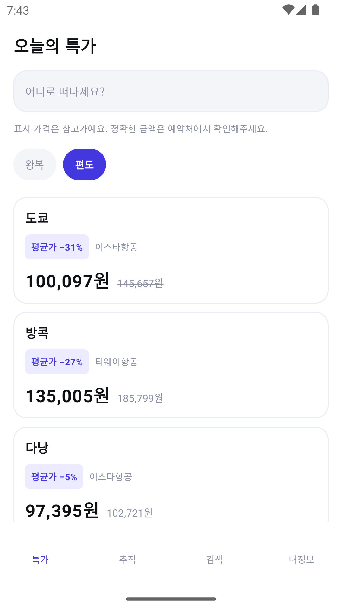

# flightdeal

인천 출발 항공권의 특가를 모아 보여주고, 지정한 노선의 가격 변동을 감지해 알림을 주는 안드로이드 앱.

<p align="left">
  
  
  
  
</p>

실제 Travelpayouts 데이터다. 왕복 도쿄 304,619원(−19%), 편도로 바꾸면 100,097원(−31%).

## "실시간 요금 변동"에 대해

이 앱의 출발점은 "항공권 가격이 바뀌는 걸 실시간으로 알 수 있나"라는 질문이었다.
조사한 결론은 **불가능하다**는 것이다. 항공사나 GDS가 가격 변동을 푸시로 전달하는 공개 API는
존재하지 않는다. 국내 여행 앱들이 "평균가 대비 N% 저렴"을 말할 수 있는 이유는
서버가 가격을 계속 조회해 이력 DB를 쌓고 있기 때문이다.

그래서 이 앱도 **폴링 + 가격 이력 + 임계치 판정** 구조를 쓴다. 1단계에서는 그 이력이
서버가 아니라 단말의 Room에 쌓이고, WorkManager가 6시간마다 깨어나 비교한다.
"실시간"이라고 말하지 않고, 화면에도 표시 가격이 참고가임을 명시한다.

## 아키텍처

```
:presentation   → :domain, :data     Composable / ViewModel / Navigation Compose
:data           → :domain            Repository 구현체, Room, DataStore
:domain         (의존성 없음)          모델, Repository 인터페이스, UseCase
```

`:domain`은 순수 Kotlin JVM 모듈이다. 안드로이드 타입을 쓸 수 없고, 데이터 소스의 이름도
등장하지 않는다. 덕분에 핵심 로직 — 할인율 계산과 가격 변동 감지 — 이 에뮬레이터 없이
JVM 단위 테스트만으로 검증된다.

이 경계는 이미 한 번 값을 했다. UI를 XML DataBinding에서 Compose로 통째로 갈아엎었는데
`:domain`과 `:data`는 한 줄도 바뀌지 않았고, ViewModel과 그 테스트도 그대로 살아남았다.

## 기술 스택

Kotlin 2.1 · Jetpack Compose · Material 3 · Hilt · Coroutines/Flow · Navigation Compose ·
Room · DataStore · WorkManager · Retrofit · KSP · Gradle Version Catalog

Java 소스는 한 줄도 없다. compileSdk/targetSdk 36, minSdk 26.

## 현재 상태

Travelpayouts 실연동 + 가격 추적/알림 완료. 테스트 167건 통과
(`:domain` 59 · `:data` 86 · `:presentation` 22).

인천 출발 6개 노선의 실제 최저가를 보여주고, 왕복/편도를 전환할 수 있다.
딜을 추적하면 Room에 가격 이력이 쌓이고, WorkManager가 6시간마다 다시 조회해
변동이 있으면 알린다.
할인 배지는 그 노선·그 달의 가격 분포 중앙값과 비교해 계산한다 —
**딜과 같은 종류의 운임끼리만 비교한다.** 왕복 가격을 편도 분포와 견주면 할인이
성립하지 않아 배지가 영영 뜨지 않는데, 개발 중에 실제로 겪고 고친 문제다.

데이터 소스를 바꾸는 데 필요한 변경은 `:data`의 `RepositoryModule` 한 파일이다.
XML 뷰를 Compose로 갈아엎을 때도, Fake를 실 API로 바꿀 때도 `:domain`은 한 줄도 바뀌지 않았다.

**빈 데이터는 오류가 아니다.** 데이터 소스가 캐시 기반이라 한산한 노선은 정상적으로 빈 응답을
준다. 그래서 빈 상태에는 재시도 버튼을 숨기는 게 아니라 아예 만들지 않는다. 눌러도 결과가
같기 때문이다. 반대로 레이트 리밋과 서버 오류에는 재시도 버튼을 준다 — 잠시 뒤면 풀리니까.

### 알아둘 것

Aviasales는 러시아에서 출발한 서비스라 예약처의 절반가량이 한국에서 결제할 수 없는
CIS 마켓플레이스다. 그래서 목적지마다 **한국에서 예약 가능한 예약처를 우선**해 고르고,
그런 곳이 없으면 그 노선의 최저가라도 보여준다. 완전히 걸러내면 한산한 노선의 화면이 빈다.

표시 가격은 참고가다. 소스가 실사용자 검색 기록 기반 7일 캐시라 그 순간 실제 예약 가능한
운임과 다를 수 있고, 화면에도 그렇게 적어두었다.

### 알림이 거짓말하지 않게 만든 것

가격 추적에서 어려운 부분은 폴링이 아니라 **비교**다. 개발 중에 잡은 결함이 전부
같은 모양이었다 — 비교하는 두 값을 서로 다른 규칙으로 고르는 것.

등록할 때의 기준가는 한국에서 결제 가능한 예약처 중 최저가였는데, 폴링은 러시아
마켓플레이스를 포함한 전체 최저가를 골랐다. 두 값이 다르면 폴링 쪽이 항상 더 싸므로
**첫 실행마다 있지도 않은 하락을 알렸다.** 지금은 `trackedPrice()` 한 곳에만 규칙이
있고 양쪽이 그것을 부른다.

**"관측했다"와 "사용자에게 알렸다"도 다른 사건이다.** 둘을 같이 취급하면
`Result.retry()`가 `doWork()`를 다시 돌릴 때 1차 시도의 스냅샷이 비교 대상이 되어
전달하려던 변동을 스스로 지운다. 그래서 관측 이력(`price_snapshot`)과 통보
기준선(`tracked_route.notifiedPrice`)을 나눴고, 알림이 실제로 뜬 뒤에만 기준선이
움직인다. 채널이 꺼져 있으면 기준선은 그대로 남는다 — 놓치는 것보다 중복이 낫다.

`minSdk`가 26인데 `POST_NOTIFICATIONS`는 API 33부터라는 것도 함정이었다. 그 아래에서
`checkSelfPermission`을 부르면 시스템이 정의조차 모르는 권한이라 항상 거부로 나오고,
**지원 API 11개 중 7개에서 알림이 통째로 버려진다.** API 30 에뮬레이터에서
`dumpsys package`로 확인했다 — 권한이 요청 목록에는 있고 부여 목록에는 없다.

### 다음

- 가격 추이 그래프
- 날짜별 최저가 캘린더, 목적지 탐색, 예약처 딥링크

## 설계 문서

- [설계](docs/superpowers/specs/2026-08-28-flightdeal-design.md) — 데이터 소스 선정 근거, 도메인 모델, 추적 엔진, 에러 처리
- [구현 계획 1 — 기반](docs/superpowers/plans/2026-08-28-flightdeal-foundation.md)
- [구현 계획 2 — Travelpayouts 실연동](docs/superpowers/plans/2026-08-28-flightdeal-travelpayouts.md)
- [구현 계획 3 — 가격 이력·추적·알림](docs/superpowers/plans/2026-08-28-flightdeal-tracking.md)

## 빌드

JDK 17이 필요하다.

```bash
export JAVA_HOME="$(/usr/libexec/java_home -v 17)"
./gradlew :presentation:assembleDebug
```

API 키는 `local.properties`에 둔다 (커밋되지 않는다).

```properties
TRAVELPAYOUTS_TOKEN=...
TRAVELPAYOUTS_MARKER=...
```
